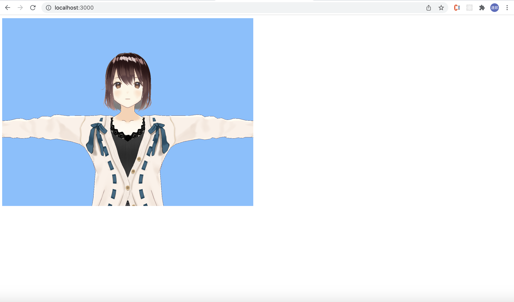

## Summary
samples for loading vrm model in threejs scene

## Install
```
git clone https://github.com/softmurata/loadvrm.git
```
```
npm install
```

## Run Command
```
npm start
```

please go to http://localhost:3000


